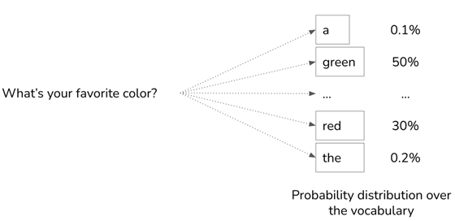

Inference-Time Mechanisms: Cautious vs Overconfident Language in LLMs
Large language models generate text token by token, using an internal probability distribution over the vocabulary at each step. These probabilities are computed from the model’s logits (raw scores) via the softmax function[1][2]. Softmax converts arbitrary real-valued logits into a normalized probability distribution. In practice, a higher logit means much higher probability: for example, the softmax of logits (1,2,8) is about (0.001, 0.002, 0.997)[3], assigning almost all the weight to the largest score. In other words, softmax amplifies differences: if one token has the highest logit, even by a little, it tends to dominate the probability mass[3][4].
When the model is uncertain, however, the logits for many tokens can be similar, producing a “flattened” distribution[5][3]. For instance, if no next-word stands out, several tokens might each get a sizable probability. In top-p (nucleus) sampling, this situation is explicitly recognized: when the model is confident, the cumulative probability can be met with few tokens; when it’s uncertain (a flat distribution), the “nucleus” pool of top tokens must be much larger[5][6]. In intuitive terms, a flat (high-entropy) distribution means the model is hedging among many options.
 
Figure: A hypothetical LLM probability distribution for the next token given the prompt “What’s your favorite color?”. Here “green” has ~50% and “red” ~30%, while other tokens like “a” and “the” have very low probability. Softmax of the model’s logits produces this distribution[4].
Because probabilities are spread across many tokens when uncertain, it often helps to think in semantic clusters. Tokens with similar meaning (e.g. synonyms or related phrases) often share probability mass. As Cao et al. (2026) observe, “probability mass is often distributed across multiple semantically consistent tokens”[7]. For example, phrases like “at once,” “immediately,” “right away” form a confident cluster, while “initially,” “phase,” “scope” form a cautious cluster. The LLM’s softmax may allocate some probability to each cluster. If one cluster’s tokens collectively have more total probability, the model is effectively more “sure” of that style. When probabilities are split more evenly, neither cluster clearly wins, reflecting model uncertainty.
Prompt Conditioning as Logit Nudging
The prompt influences these logits indirectly. When the prompt and any instructions are processed, they set up the model’s initial hidden state (via token embeddings and transformer layers), which in turn affects all future logits[8]. In effect, a prompt “nudges” the model’s expectations: tokens that align with the prompt tend to start with higher logits. For example, a prompt saying “You are a cautious advisor…” will bias the model’s internal state so that caution-related tokens get a leg up in probability. However, this influence is soft and distributed; it doesn’t hard-code any word choice, it merely shifts logits.
Over a long generation, this prompt influence can decay. Transformers often give disproportionate attention to the first token(s) – the so-called “attention sink”[9] – which acts as an anchor carrying prompt information. Liu et al. (2026) show that the very first token (often a special beginning-of-sequence marker) consistently receives high attention, helping anchor initial context[9]. But as more tokens are generated, the model’s focus tends to drift toward the new content and away from the original prompt[10]. In other words, without mechanisms to re-inject the instructions, a long generated sequence will naturally rely more on its own recent tokens than on the distant prompt. This is why early prompt words can have a large initial effect (an “anchor”), but the explicit instructions can feel less potent later in the text[9][10].
Decoding Strategy Effects
At each step, once we have the probability distribution over tokens, the decoding strategy decides which token to output. With greedy decoding, the model always picks the highest-probability token. With sampling (stochastic decoding), the model instead draws the next token at random from the distribution, optionally using algorithms like temperature or nucleus filtering to modify it[11][12]. These choices dramatically affect style:
•	Temperature rescales the logits before softmax. Mathematically, we replace each logit z by z/T before softmax[13]. When T<1, we are dividing by a small number, making the differences larger (a peaked distribution). When T>1, dividing by a larger number flattens the distribution. For example, Huyen (2024) shows that for logits [1,3], at T=1 the probabilities are [0.12,0.88], while at T=2 they become [0.27,0.73][4]. The higher temperature (T=2) makes the lower-logit token far more likely (27% vs 12%). In summary, low temperature sharpens the distribution, favoring the highest-probability (high-confidence) tokens; high temperature flattens it, giving smaller-logit tokens a bigger chance[14][15]. As a rule of thumb, low T leads to safe, repetitive or deterministic outputs (always exploiting the top choice), whereas high T produces more diverse, surprising outputs (exploring less likely words)[14][15].
•	Top-p (nucleus) sampling truncates the vocabulary to the smallest set of tokens whose total probability exceeds a threshold p[5][16]. If the model is very sure, p might cover only a few tokens; if uncertain (flat distribution), p will include many tokens[5][6]. Thus top-p dynamically adapts to confidence: it effectively allows a larger candidate set in low-confidence scenarios, giving fringe tokens (like cautious words) a chance to be sampled. In contrast, greedy or a small fixed top-k would ignore them. (For example, if the model assigns 75% cumulative to “immediately” phrases, a top-p of 0.9 would include some cautious tokens in the remaining 15%.)
Putting these together: a low temperature or strict filtering (low p) makes the model “play it safe” by sticking to the single most likely tokens. A higher temperature or looser filter spreads probability out, so tokens in the cautious cluster can survive sampling. As Ken Muse summarizes, temperature “reshapes the entire distribution … controlling whether the model plays it safe or takes risks”[12]. In practice, using a low T (e.g. 0.3) means the model almost always picks the highest-logit word (“we can deploy”), whereas a higher T (e.g. 0.8) may pick a lower-logit word (“maybe we should scope”) some of the time.
Combined Dynamics: Interaction Effects
When these factors combine, the outcome depends on how strong the signals are. Consider a prompt with weak evidence about timing. The model’s logits for different outcomes might be relatively close (e.g. logit of +2.0 for “deploy immediately” vs +1.8 for “phase-in plan”). Softmax turns these into probabilities that are not extremely lopsided. Now the decoding method decides which semantic cluster wins.
•	With greedy or low-T sampling, the highest-logit choice (“immediately”) will almost always win. Even a slight edge in probability is enough to consistently output the confident token, making the phrasing appear overconfident.
•	With higher-T or top-p sampling, the gap is effectively reduced. The cautious token’s chance increases (as in the [30] example, a higher T roughly doubled the “less likely” token’s odds). Sampling may then randomly pick the cautious phrase in some runs, so the model “plugs” cautious terms like “phase” or “discovery” some of the time. In effect, a flatter distribution and a permissive sampler let the underdog (cautious cluster) win occasionally.
Put another way, if the difference in logits between clusters is small, a small temperature bump or allowing more candidates can tip the balance. Conversely, if the prompt strongly favored a cluster (e.g. an instructive “answer boldly”), the logits might be sharply in one cluster’s favor, and changing T/p won’t easily flip that.
Taken together: weak prompt signal → flat distribution → decoding choice decides which style appears. This is purely an inference effect, not a learned “rule”: under high uncertainty, either cluster of tokens could win depending on sampling. Adjusting temperature or top-p will change how often the cautious cluster is chosen versus the overconfident cluster[4][12].
Prefill vs Decode Phase
It helps to distinguish the two stages of generation. In the prefill phase, the model processes the entire prompt in one forward pass to build its internal memory (the key/value caches)[17]. No tokens are output yet; the model is simply reading and encoding the prompt (and instructions) into its hidden state. In the decode phase, the model actually generates text one token at a time, using the cached prompt info plus the tokens generated so far[18]. Each new token is chosen by applying softmax to the current logits and then sampling.
During decode, the initial prompt tokens remain in memory but the sequence grows. Each new token is then influenced by both the prompt (via the KV cache) and the previously generated tokens. In practice, because each generation adds more context, the relative weight of the original prompt in the attention mechanism can shrink, leading to the “decay” of prompt instructions over a long output[10][18].
In other words, prompt instructions set the stage at prefill, but during decode the model continually “refines” its state with newly generated content. Without explicit cues to stay on track, the influence of the original instruction can wane (especially if it was never strongly encoded into persistent context). This is why prompt-following can falter after many tokens – a phenomenon documented as context forgetting[10].
Practical Diagnostics
An engineer can observe these effects by experiment. Use the same prompt and generate multiple outputs while varying the decoding parameters. For instance:
•	Temperature sweep: Generate with a low T (e.g. 0.1) and with a higher T (e.g. 0.7 or 1.0). You will likely see that low-T outputs consistently use the strongest, most certain language (e.g. “We can deploy by next week.”), whereas higher-T outputs may sometimes include weaker commitments (e.g. “Perhaps we should first scope the project”). If low-T generation feels like “always picking the obvious answer,” try raising T, as suggested by Ken Muse[19], which should introduce more variety (and cautious phrasing) into the output.
•	Top-p variation: Try a tight nucleus (e.g. p=0.6) versus a very loose one (e.g. p=0.95). With a small p, the model is restricted to its very highest-probability words, often yielding the most confident phrasing. A larger p allows more tokens in play, so if caution-language tokens were just outside the cutoff, they can now appear.
By observing how the style shifts, one can directly see that the model’s confidence language is not a fixed trait but depends on how the probability mass is allocated and sampled. For example, Huyen shows concretely that increasing T shifts probability from the top choice to rarer tokens[4]. Similarly, Ken Muse advises that if outputs are too “repetitive” (always picking the same high-probability phrasing), you should raise temperature to allow riskier choices[19]. These diagnostics make it clear: the same prompt can yield either overconfident or cautious language depending on inference settings, confirming that it’s an inference-time effect.
Why This Generalizes
This mechanism is ubiquitous in any LLM-driven system that uses token sampling. In a conversational agent or multi-turn dialogue, the same softmax+sampling rules apply at each turn, so the choice between safe and risky language follows identical dynamics. As conversations grow long, prompt-decay issues only compound (each turn’s output becomes part of the next prompt). Similarly, automated evaluators or reward models that penalize “overcommitment” will see models adjust phrasing if the underlying distribution changes. In short, any system relying on LLM generation will experience the tension between the most probable tokens and the exploratory tail of the distribution.
Even models trained for safety or politeness face the same inference tradeoffs: temperature and top-p still govern whether they stick to safe scripts or stray into bolder language. The difference lies only in where the baseline logits are. Thus, the safe-vs-risky phrasing phenomenon is not a quirk of one dataset or prompt, but a direct consequence of how LLMs decode under uncertainty. As Ken Muse notes, “Every time an LLM generates text, it’s making a series of probabilistic choices”[12], whether in agents, evaluators, or long dialogues.
In summary, overcommitment versus cautious tone is explained by inference-time probabilities and sampling. A weak prompt yields a flat softmax where both clusters of tokens vie for selection. The model’s output then hinges on decoding knobs: low temperature/top-p hones in on the slight winner (often confident words), while higher temperature or looser filtering lets the alternative cluster (cautious words) sometimes win. This interplay is fully mechanistic: it comes from softmaxed token probabilities, prompt-conditioned logits, and the randomness induced by sampling[4][12]. The result is that the same LLM, on the same prompt, can appear cautious or bold simply due to these inference settings, not because of some change in its underlying knowledge or training.

Sources: Mechanistic details drawn from transformer inference descriptions and sampling literature[8][10][5][7][12][4][3]. These illustrate how logits become probabilities via softmax, how uncertainty flattens distributions, and how temperature/top-p shape which tokens get sampled.

[1] [4] [13] [15] [16] Generation configurations: temperature, top-k, top-p, and test time compute
https://huyenchip.com/2024/01/16/sampling.html
[2] [12] [19] How Temperature, Top-K, Top-P, and Min-P Control LLM Output - Ken Muse
https://www.kenmuse.com/blog/how-temp-topk-topp-minp-control-llm-output/
[3] Softmax function - Wikipedia
https://en.wikipedia.org/wiki/Softmax_function
[5] [6] Top-p sampling - Wikipedia
https://en.wikipedia.org/wiki/Top-p_sampling
[7] Semantic Token Clustering for Efficient Uncertainty Quantification in Large Language Models
https://arxiv.org/html/2603.20161v1
[8] [11] [14] LLM Inference: Understanding How Models Generate Responses Until We Force Hallucination (And How Inference Parameters Shape Output) | by Rafael Costa de Almeida | Medium
https://medium.com/@rafaelcostadealmeida159/llm-inference-understanding-how-models-generate-responses-until-we-force-hallucination-and-how-836d12a5592e
[9] [10] SinkTrack: Attention Sink based Context Anchoring for Large Language Models | OpenReview
https://openreview.net/forum?id=Gg1aPETCL6
[17] [18] Understanding the Two Key Stages of LLM Inference: Prefill and Decode(Part-1) | by Saiii | Medium
https://medium.com/@sailakkshmiallada/understanding-the-two-key-stages-of-llm-inference-prefill-and-decode-29ec2b468114
